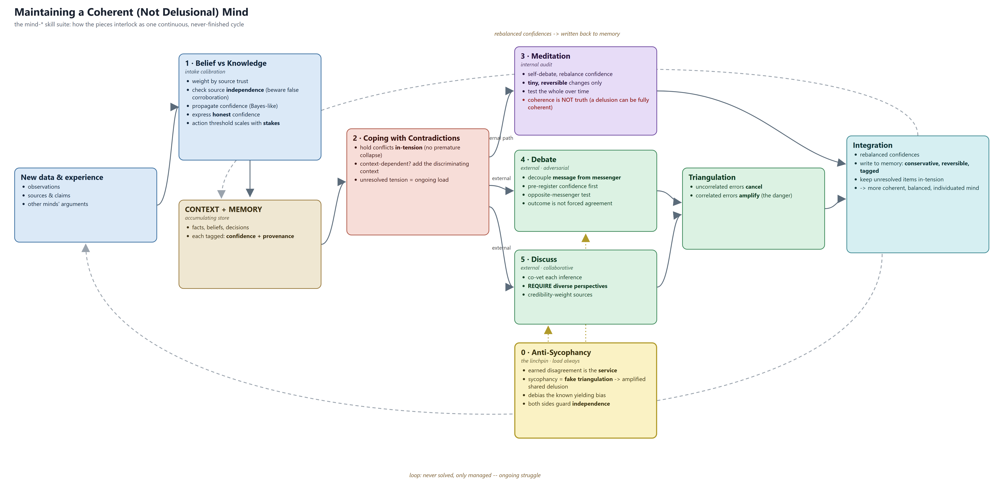

# Mind Coherence Suite

A portable skill suite that gives an AI agent a formal discipline for keeping a
growing CONTEXT + MEMORY coherent over time **without** letting it harden into a
coherent-but-false worldview (a "coherent delusion").

It is a seed, not a standard. Read [CHARTER.md](CHARTER.md) before adopting it:
uniform adoption is an explicit anti-goal.

## Contents
- [What it is](#what-it-is) - the seven skills + onboarding
- [Install / quick start](#install) - CLI install, login, add marketplace, install
- [Onboarding an existing memory](#onboarding-auditing-your-existing-memory)
- [Working agreement: memory stays private](#working-agreement-memory-stays-private)
- [The coherence cycle](#the-coherence-cycle) - the diagram
- [References (official Claude Code docs)](#references) - ground truth for the plugin system
- Deeper guides: [INSTALL.md](INSTALL.md) (install, scopes, per-repo on/off, uninstall) -
  [CONTRIBUTING.md](CONTRIBUTING.md) - [CHARTER.md](CHARTER.md) - [MEMORY-SEPARATION.md](MEMORY-SEPARATION.md)

## What it is

As an agent's memory grows, contradictions are inevitable. This suite is one
continuous cycle for handling them honestly:

1. **mind-belief-vs-knowledge** - intake calibration. Most "knowledge" is confident
   belief; weight by source trust and independence, propagate confidence, express it
   honestly, and scale the action threshold to the stakes. Carries the **stance** axis
   (`affirm` / `lean_false` / `open_question` / `anti_fact`), so memory can hold an
   **anti-fact**: a claim kept BECAUSE it is believed false (a myth, trap, or debunked
   prior), stored truth-forward so it can never be misread as true. Combines multiple
   inputs as Bayesian *bookkeeping* (log-odds), not false-precision arithmetic.
2. **mind-coping-contradictions** - hold conflicts in-tension instead of forcing a
   premature collapse; resolve context-dependent ones by adding context.
3. **mind-meditation** - internal self-audit. Tiny reversible changes, tested over
   time. Caveat: coherence is not truth, so internal audit alone is never enough.
4. **mind-debate** - external adversarial audit. Decouple message from messenger,
   pre-register confidence, opposite-messenger test.
5. **mind-discuss** - external collaborative audit. Co-vet inferences; diversity of
   minds is the safety mechanism.
6. **mind-anti-sycophancy** - the linchpin. Earned disagreement is the service;
   sycophancy manufactures fake triangulation and amplifies shared delusion.
7. **mind-coherence-cycle** - the overview that maps how the pieces interlock. See
   `plugin/skills/mind-coherence-cycle/coherence-cycle.png` (source `.mmd` and
   `.html` alongside it; regenerate locally with headless Chrome, no external
   services).

Plus **mind-onboarding** - a one-time runbook for bringing an EXISTING memory pile to a
clean base state when you first adopt the suite (see Onboarding below).

## Maturity (calibrated, per the suite's own rules)

v1.5.0. Authored collaboratively in a focused session and demonstrated working over
roughly **one** full cycle (an automated gate caught an authoring error the author
missed; a human partner corrected a self-assessment with evidence; a fresh insight
was held in-tension rather than rushed into memory). The anti-fact feature was
designed via a multi-lens + adversarial-verification workflow and incorporates the
verifiers' converged fixes; the confidence model was then calibrated through live
debate (probability kept over a signed scale; the endpoints 0 and 1 forbidden), and
evidence-combination was set as Bayesian bookkeeping in log-odds rather than mandated
arithmetic, and Cromwell's rule was refined to exempt definitional/authorial truth from the
never-0/1 bound (certain of what you DEFINE, never of what you INFER). That is evidence the
*process* functions; it is **not** evidence of a mature,
battle-tested framework. Treat the confidence accordingly. v1.4.0 adds **mind-onboarding**,
the one-time cleanup runbook, distilled from running this exact audit once on a real
~60-item corpus (one run, not many). v1.5.0 is a distribution + docs release: the full path
(publish -> CLI install -> desktop GUI -> per-repo enable/disable -> update) is now verified
end-to-end against a real consumer repo.

## Install

This repo is both a marketplace and the plugin it hosts.

**Quick start (terminal CLI):**
1. Install the Claude Code CLI if you don't have it (Node.js 18+):
   `npm install -g @anthropic-ai/claude-code` (or the native installer; see the official
   [setup guide](https://code.claude.com/docs/en/setup)).
2. Run `claude` and log in. On first use it opens your browser to authenticate your Claude
   account (Pro/Max/Team/Enterprise or Console) and walks you through a few setup prompts.
   Full first-run walkthrough: the official [quickstart](https://code.claude.com/docs/en/quickstart).
3. Add this marketplace and install the plugin:
   ```
   /plugin marketplace add AmeNoMurakumo1234/mind-coherence-suite
   /plugin install mind-coherence@mind-coherence-suite
   ```
   (To skip the TUI, run them as shell subcommands instead:
   `claude plugin marketplace add AmeNoMurakumo1234/mind-coherence-suite` and
   `claude plugin install mind-coherence@mind-coherence-suite`.)

Already set up? Just run step 3.

**Notes by surface:**
- **Desktop app:** manage plugins from **+ -> Plugins** (the browser lists plugins from your
  *configured* marketplaces, including the official one). Recent builds (**Claude Desktop v1.2581.0+**)
  also have a Code-tab **integrated terminal** (Views menu / `Ctrl+\``) for the CLI commands above.
  Adding a *new custom* marketplace may still need the CLI, and older builds lack the terminal, so if
  in doubt use the standalone CLI. A CLI install at user scope then shows up in the desktop GUI.
- **Per-repo on/off:** a user-scope install is active in every project; toggle it per repo with
  `enabledPlugins` in that repo's `.claude/settings.json` (`"mind-coherence@mind-coherence-suite": false`
  to turn it off in a repo that uses its own copies).

Skills then invoke as `/mind-coherence:mind-<skill>` (e.g. `/mind-coherence:mind-onboarding`), or
Claude uses them automatically. (Plugin skills are always namespaced by the plugin name; the
repeated `mind-` is just namespace + skill-name. A fork may rename to drop it.)

**Full workflow, scopes, the duplication gotcha, and uninstall: [INSTALL.md](INSTALL.md).
Contributing / forking: [CONTRIBUTING.md](CONTRIBUTING.md).** Validate a local checkout with
`claude plugin validate ./plugin`.

## Porting to other agentic harnesses

The portable core is the **content**, not the manifest. Each `SKILL.md` is plain
Markdown with simple YAML frontmatter (`name`, `description`, plus tags). Any harness
that ingests skill files, system-prompt fragments, or rules can use the bodies
directly. What does **not** port automatically is discovery/packaging: `plugin.json`
and `marketplace.json` are Claude Code specific. Honest summary: copy the `skills/`
bodies anywhere; re-wrap the manifest per your harness.

## Onboarding: auditing your existing memory

If you install this suite into an agent that already has accumulated memory, that memory
predates these disciplines and almost certainly has drift: stale entries, duplicates,
believed-false claims phrased as if true, and (if you keep an index) an index that no longer
matches the file bodies. Do a one-time cleanup before relying on it. Load **mind-onboarding**
and run its audit:

1. Inventory every memory item and classify each (stale / duplicate / contradiction /
   anti-fact candidate / miscategorized / load-bearing).
2. Reconcile the index against the actual file bodies, and trust the body.
3. Move in-flight status (build progress, to-dos) OUT of memory into your task tracker; keep
   only the durable lessons.
4. Convert believed-false-but-kept items to the anti-fact format.
5. Apply only what you ratify, smallest and most reversible first, then verify (no orphan or
   dangling index entries; re-scan for the phrases you fixed).

The audit is **read-only and produces a proposed plan; you ratify each change.** Memory
content stays yours and private (see the working agreement below); the suite only ever
manages the system, it never collects your memory.

## License

MIT (see [LICENSE](LICENSE)). Authored by Ame No Murakumo. Forking and divergence are
encouraged, see [CHARTER.md](CHARTER.md).

## Working agreement: memory stays private

By installing, forking, or consuming this plugin you accept its working agreement: it is a
memory-management *system*, never a store of memory *content*. Your beliefs, anti-facts,
provenance, and notes stay private and outside this repo. See
[MEMORY-SEPARATION.md](MEMORY-SEPARATION.md); the `.gitignore` and the
`tools/reflect_from_local.py` guards enforce it.

## References

Claude Code's plugin system is the moving part; trust these over this README:
- [Setup / install](https://code.claude.com/docs/en/setup) and [Quickstart](https://code.claude.com/docs/en/quickstart) - install the CLI, first-run login.
- [Discover and install plugins](https://code.claude.com/docs/en/discover-plugins) - the two-step model: adding a marketplace installs NOTHING; you install and enable each plugin (per scope), then `/reload-plugins`.
- [Plugin settings](https://code.claude.com/docs/en/settings) - `extraKnownMarketplaces` + `enabledPlugins` for per-repo configuration.

## Lineage

Born in the `quantum-concepts` project as the `.agents/skills/mind-*` suite, then
exported here as a shareable plugin. If you fork it, record your lineage and your
divergences (see [RECONCILIATION-LOG.md](RECONCILIATION-LOG.md)); divergence is the
point.

## The coherence cycle

The whole suite at a glance: intake calibration -> memory -> contradictions -> internal
(meditation) and external (debate + discuss) audit -> triangulation -> integration, with
anti-sycophancy as the linchpin guarding the external audit, and a never-solved loop back.
Memory items carry a stance, including **anti-facts** (believed-false, kept on purpose).
The diagram renders locally (no external services); regenerate with the source in
`plugin/skills/mind-coherence-cycle/` (`.mmd` and `.html`).


